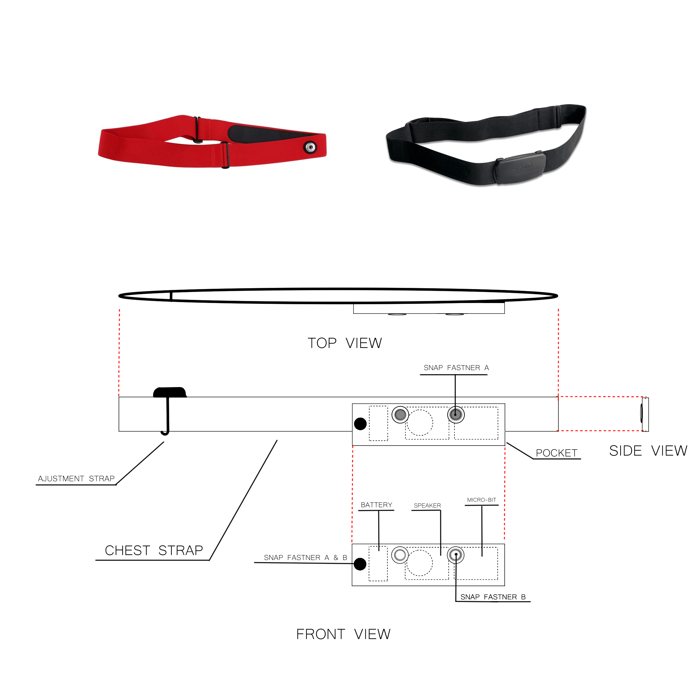
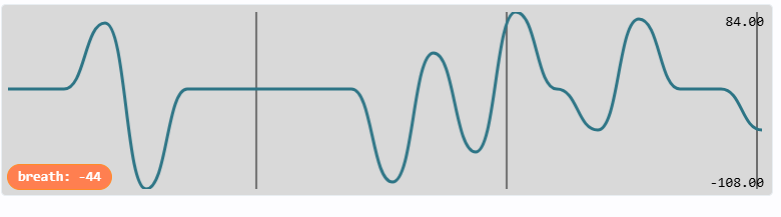

# Initial Concept


# Code Concept
```
When Button A Pressed
    Start waiting for breath

forever loop
    measure how much movement in the Z axis

    check movement speed (check if breath)
        if first breath
            record time of first breath
        if second breath
            record how long first breath - second breath took.
    record time of last/current breath

    else if no movement
        if time taken to breath > time taken between first and second breath
            alert person to breath

When Button B pressed
    Stop Program
```


# Code Progress
## Version 1
```
let speed = 0
let currentZ = 0
let lastZ = input.acceleration(Dimension.Z)
basic.forever(function () {
    currentZ = input.acceleration(Dimension.Z)
    speed = currentZ - lastZ
    lastZ = currentZ
    speed = speed / 1
    if (speed >= 1) {
        speed = speed - 1
    } else {
        if (speed < 0) {
            speed = speed + 1
        }
    }
    // Send to simulator/USB serial console
    serial.writeValue("speed", speed)
    basic.pause(1)
})
```
used to get variables of speed for breathing, used for inital speed calculations and filtering.



## Version 2
```
let lastZ = input.acceleration(Dimension.Z)
let speed = 0

// Standard breathing threshold
let THRESHOLD = 80      // central mg
let RANGE = 40          // +/- leeway

basic.forever(function () {
    let currentZ = input.acceleration(Dimension.Z)
    speed = currentZ - lastZ
    lastZ = currentZ

    let absSpeed = Math.abs(speed)
```
```
    if (absSpeed >= (THRESHOLD - RANGE) && absSpeed <= (THRESHOLD + RANGE)) {
        // breathing detected
        basic.showIcon(IconNames.Heart)   // show breathing
        serial.writeValue("breath", speed)
    } else {
        basic.showIcon(IconNames.SmallDiamond) // idle / no breathing
        serial.writeValue("breath", 0)
    }

    basic.pause(200)
})
```
used to introduce a cleaner more effective speed filter with acceptable leeway, less messy and uses larger numbers to calculate breathing meaning faster and slower movements are less likley to be picked up by the microbit.

## Version 3
```
// On Button A press
input.onButtonPressed(Button.A, function () {
    waitingForBreath = true
    isFirstBreath = false
    breathTIME = 0
    firstBreathTime = 0
    lastBreathTime = 0
})
// Button B Press
input.onButtonPressed(Button.B, function () {
    waitingForBreath = false
})
```
Adding a start and stop option using the microbits buttons.
```
// Variables
let absSpeed = 0
let speed = 0
let currentZ = 0
let lastBreathTime = 0
let firstBreathTime = 0
let breathTIME = 0
let isFirstBreath = false
let waitingForBreath = false
let lastZ = input.acceleration(Dimension.Z)
let THRESHOLD = 80
let RANGE = 40
// Main loop / Function
basic.forever(function () {
    if (waitingForBreath == true) {
        // measure change in Z acceleration
        currentZ = input.acceleration(Dimension.Z)
        speed = currentZ - lastZ
        lastZ = currentZ
        absSpeed = Math.abs(speed)
    ```
    ```
        // breathing detected if speed is in range
        if (absSpeed >= THRESHOLD - RANGE && absSpeed <= THRESHOLD + RANGE) {
            if (waitingForBreath) {
                if (!(isFirstBreath)) {
                    // first breath detected
                    firstBreathTime = input.runningTime()
                    isFirstBreath = true
                } else {
                    // second breath → calculate time between breaths
                    breathTIME = input.runningTime() - firstBreathTime
                    isFirstBreath = false
                }
            }
            // update timestamp of last detected breath
            lastBreathTime = input.runningTime()
            basic.showIcon(IconNames.Heart)
        } else {
            // no breath detected
            basic.showIcon(IconNames.SmallDiamond)
            // check if too long has passed without a breath
            if (breathTIME > 0 && input.runningTime() - lastBreathTime > breathTIME) {
                // X
                basic.showIcon(IconNames.No)
            }
        }
        basic.pause(200)
    }
})
```
adding a time filter, detecting for time taken to  breath, so if it exceeds time of the first 2 breaths itll alert the user to breath.

# Prototype
image here
whats new